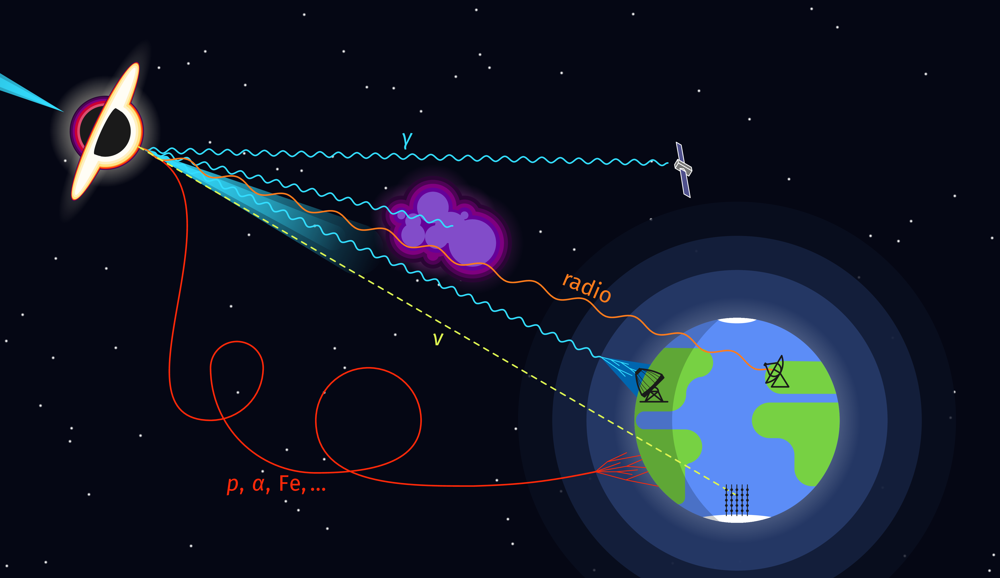

[](https://zenodo.org/doi/10.5281/zenodo.11580793)

# Cosmic Messenger Origin

Minimalistic graphic showing the origin of various cosmic messengers.



## Usage
In the root directory, call
```
$ make [all,build/cm_overview.pdf]
```
to build the graphic. An installation of TeXLive is required.

## Citation
If you want to include this graphic in a project or scientific work, refer to the Zenodo DOI above or cite it as follows:
```
@software{Knierim_Cosmic_Messengers_2024,
author = {Knierim, Anno},
doi = {10.5281/zenodo.13165204},
month = aug,
title = {{Cosmic Messengers}},
url = {https://github.com/aknierim/cosmic_messenger_origin},
version = {2.0},
year = {2024}
}
```
